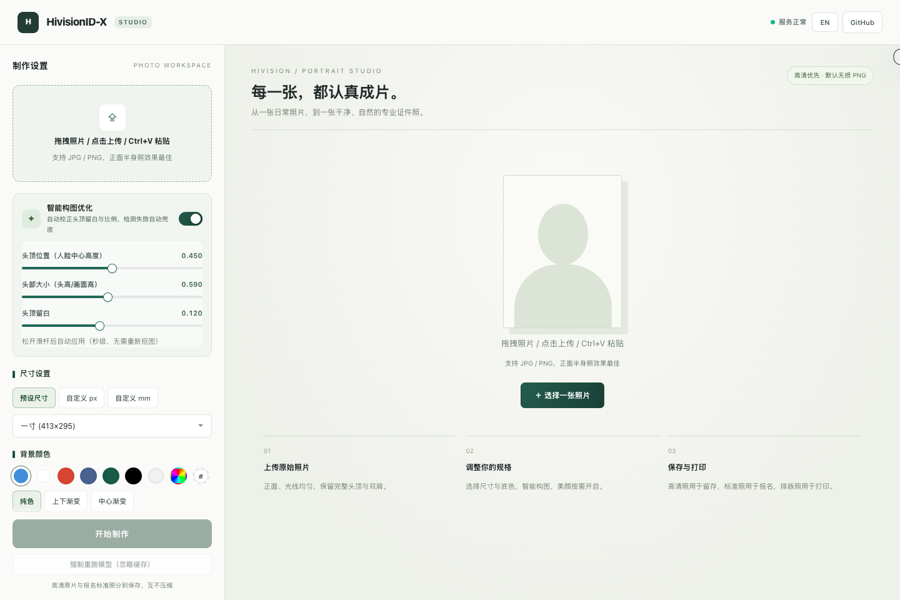

# HivisionID-X

可自行部署的证件照工作台：上传照片，调整构图与底色，下载标准照、高清照和打印排版照。

**中文** · [English](README_EN.md) · [Docker Hub](https://hub.docker.com/r/chilin11/hivisionid-x) · [反馈问题](https://github.com/chilin11/HivisionID-X/issues)

> 本项目 fork 自 **[Zeyi-Lin/HivisionIDPhotos](https://github.com/Zeyi-Lin/HivisionIDPhotos)**，由 [chilin11](https://github.com/chilin11) 在其基础上继续开发。HivisionID-X 重构了 Web 工作台、API 服务与智能构图流程，底层证件照处理能力仍建立在上游项目及开源模型的工作之上。



*当前版本真实界面截图，展示上传前的工作台。*

<details>
<summary>查看手机界面</summary>


</details>

## 功能

- **照片制作工作台**：拖拽、选择文件和剪贴板粘贴，中英文切换，适配桌面与手机。
- **智能构图**：默认头高占比 **59%**，页面可在 **50%–69%** 调整；原图空间允许时，头顶留白保持 **10%–12%**。避免为了身体贴底再次放大头部，给颈部和肩膀留下空间。
- **大图自动处理**：上传文件最大 **40 MB**。超过 **2400 万像素**时自动等比例缩小，保留完整画面；较小照片保持原尺寸，并按 EXIF 信息校正方向。
- **抠图与换底**：默认 BEN2 + RetinaFace，可切换模型，选择纯色、渐变或自定义背景。
- **尺寸与输出**：预设尺寸、自定义像素或毫米；标准照与高清照分别下载，支持 PNG、JPEG、DPI、目标 KB 和水印设置。
- **打印排版**：5/6 英寸、A4、3R、4R 排版及裁剪线。
- **可选增强**：亮度、对比度、饱和度、美白、锐化、人脸矫正、水平翻转和 AI 超分。
- **自部署与 API**：FastAPI 提供网页和接口，Docker 镜像支持 `linux/amd64`（x86_64）与 `linux/arm64`。

## 快速启动：Docker

发布镜像包含模型权重，Docker 自动选择机器对应的架构，无需单独安装 Python 或构建前端。

```bash
docker pull chilin11/hivisionid-x:latest
docker run -d \
  --name hivisionid-x \
  --restart unless-stopped \
  -p 7860:7860 \
  chilin11/hivisionid-x:latest
```

浏览器打开 **[http://localhost:7860](http://localhost:7860)**。

### Docker Compose

创建 `compose.yaml`：

```yaml
services:
  hivisionid-x:
    image: chilin11/hivisionid-x:latest
    restart: unless-stopped
    ports:
      - "7860:7860"
```

启动或更新：

```bash
docker compose pull
docker compose up -d --no-build --force-recreate
```

**仅重启容器不会更新镜像。** 已有服务需要先拉取，再重建容器。仓库自带的 `docker-compose.yml` 同时支持本地构建；使用发布镜像时加上 `--no-build`。

```bash
docker compose logs --tail=100
curl http://localhost:7860/health
```

## 制作流程

1. 上传清晰的正面照片，包含完整头顶、双肩和上胸部。
2. 选择尺寸和底色，按需要调整构图与输出设置。
3. 点击「开始制作」，检查结果；构图滑杆可复用抠图结果重新裁剪。
4. 分别下载标准照、高清照或打印排版照。

59% 是本项目的默认构图偏好。预设名称主要用于选择输出尺寸，**不代表已经校验所有证件规范**；具体用途还需核对背景、头部尺寸、眼位和文件要求。原图缺少肩膀时，裁剪无法恢复缺失内容；AI 超分也不保证还原真实细节。

## 本地开发

Docker 使用 Python 3.10；本地建议使用 Python 3.10 或更新且兼容依赖的版本。

```bash
git clone https://github.com/chilin11/HivisionID-X.git
cd HivisionID-X
python3 -m venv venv
source venv/bin/activate
python -m pip install -r requirements.txt
```

Windows 使用 `venv\Scripts\activate` 激活环境。

### 准备模型

模型文件不纳入 Git。默认模型需要以下文件，下载后保存到对应位置：

| 用途 | 文件位置 | 下载 |
| --- | --- | --- |
| BEN2 抠图 | `hivision/creator/weights/BEN2_Base.onnx` | [BEN2 ONNX](https://huggingface.co/PramaLLC/BEN2/resolve/main/BEN2_Base.onnx) |
| RetinaFace 人脸检测 | `hivision/creator/retinaface/weights/retinaface-resnet50.onnx` | [上游权重](https://github.com/Zeyi-Lin/HivisionIDPhotos/releases/download/pretrained-model/retinaface-resnet50.onnx) |

BEN2 缺失时会尝试联网下载，提前准备可避免首次制作时等待。请确认保存的文件名与上表一致。超分权重为可选项，加载说明见 [server/super_res.py](server/super_res.py)。

### 启动服务

```bash
python deploy_api.py
```

打开 [http://127.0.0.1:7860](http://127.0.0.1:7860)。macOS/Linux 可用 `PORT=7861 python deploy_api.py` 修改端口；按 `Ctrl+C` 停止服务。

网页由后端直接提供，源码在 `web-ui/dist/`，无需 npm 构建。修改 Python 后重启服务，修改界面后刷新浏览器。

## API

服务启动后，访问 **[/docs](http://localhost:7860/docs)** 查看交互文档、参数和响应结构。

| 方法 | 路径 | 用途 |
| --- | --- | --- |
| GET | `/health` | 服务状态、超分可用性 |
| POST | `/idphoto` | 抠图、智能构图、可选换底与证件照输出 |
| POST | `/idphoto_crop` | 智能裁剪输出 |
| POST | `/human_matting` | 人像抠图 |
| POST | `/add_background` | 背景合成 |
| POST | `/generate_layout_photos` | 打印排版 |
| POST | `/watermark` | 添加水印 |
| POST | `/set_kb` | 调整文件大小 |

生成 295 × 413 像素蓝底照片，返回包含 Base64 图片的 JSON：

```bash
curl -X POST http://localhost:7860/idphoto \
  -F "input_image=@portrait.jpg" \
  -F "height=413" \
  -F "width=295" \
  -F "head_height_fraction=0.59" \
  -F "color=438edb"
```

## 项目结构与验证

```text
deploy_api.py          服务启动入口
server/                FastAPI、构图、编解码、缓存和增强
hivision/              源自上游的证件照处理核心及扩展
web-ui/dist/           Studio 页面和样式
scripts/               模型下载等工具
test/                  裁剪、图像解码和界面回归测试
assets/                项目截图与资源
```

无需加载模型的解码与构图测试：

```bash
python -m unittest discover -s test -p 'test_*.py'
```

界面回归脚本为 `test/studio_ui.cjs`，需要 Node.js、Playwright 和对应 Chromium；使用模拟 API 响应验证交互。

自行构建前需准备模型文件。多架构发布命令：

```bash
docker buildx build --platform linux/amd64,linux/arm64 \
  -t YOUR_DOCKERHUB_USER/hivisionid-x:latest --push .
```

## 来源、致谢与许可证

HivisionID-X 是 [HivisionIDPhotos](https://github.com/Zeyi-Lin/HivisionIDPhotos) 的衍生项目，不是上游官方发行版。感谢 **Zeyi Lin、SwanLab Team 及上游贡献者**提供的证件照处理基础，也感谢 BEN2、BiRefNet、MODNet、RetinaFace、Real-ESRGAN 等模型项目与 ONNX Runtime 生态。

代码遵循 [Apache License 2.0](LICENSE)。模型权重的使用条件以各模型项目的许可证为准。

旧版[日文](README_JP.md)与[韩文](README_KO.md)文档保留了上游内容，尚未同步当前 Studio；请以本 README 或[英文版](README_EN.md)为准。
