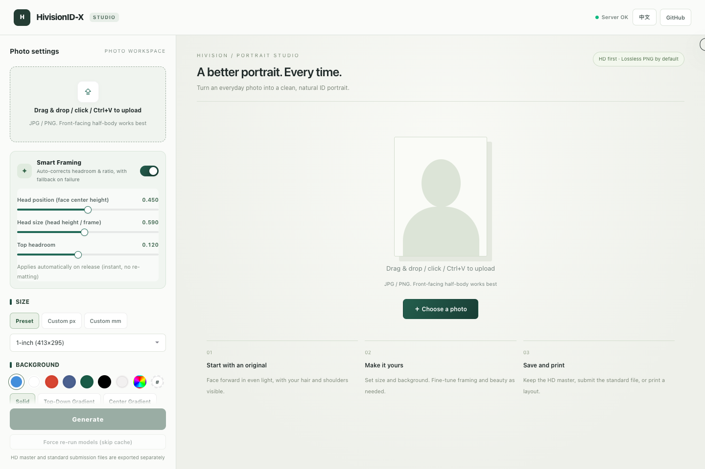
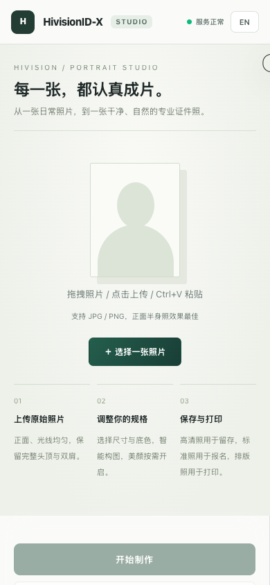

# HivisionID-X

A self-hosted ID photo workspace: upload a portrait, adjust framing and background, and download standard photos, high-resolution images, and print layouts.

[中文](README.md) · **English** · [Docker Hub](https://hub.docker.com/r/chilin11/hivisionid-x) · [Report an issue](https://github.com/chilin11/HivisionID-X/issues)

> **Forked from [Zeyi-Lin/HivisionIDPhotos](https://github.com/Zeyi-Lin/HivisionIDPhotos)** and developed further by [chilin11](https://github.com/chilin11). HivisionID-X reworks the web workspace, API service, and smart framing pipeline while building on the upstream photo-processing core and open-source models.



*Actual screenshot of the current workspace before uploading a photo.*

<details>
<summary>Mobile view (Chinese interface)</summary>



</details>

## Features

- **Photo workspace:** drag and drop, file selection, clipboard paste, Chinese/English switching, and responsive desktop/mobile layouts.
- **Smart framing:** default head height of **59%**, adjustable from **50% to 69%** in the UI. When source space permits, headroom stays within **10%–12%**. Bottom alignment no longer zooms in unnecessarily, preserving room for the neck and shoulders.
- **Large-photo handling:** files up to **40 MB**; images above **24 megapixels** are resized proportionally without cropping. Smaller images keep their dimensions; EXIF orientation is applied.
- **Matting and backgrounds:** BEN2 + RetinaFace by default, selectable models, solid/gradient/custom backgrounds.
- **Sizes and downloads:** presets, custom pixels or millimeters, separate standard and high-resolution outputs, PNG/JPEG, DPI, target KB, and watermarks.
- **Print layouts:** 5/6-inch, A4, 3R, and 4R sheets with optional cutting guides.
- **Optional adjustments:** brightness, contrast, saturation, whitening, sharpening, face alignment, horizontal flip, and AI super-resolution.
- **Self-hosting and API:** FastAPI serves the interface and endpoints; Docker supports `linux/amd64` (x86_64) and `linux/arm64`.

## Quick start with Docker

The published image includes model weights. Docker selects the matching architecture automatically; no separate Python setup or frontend build is required.

```bash
docker pull chilin11/hivisionid-x:latest
docker run -d \
  --name hivisionid-x \
  --restart unless-stopped \
  -p 7860:7860 \
  chilin11/hivisionid-x:latest
```

Open **[http://localhost:7860](http://localhost:7860)**.

### Docker Compose

Create `compose.yaml`:

```yaml
services:
  hivisionid-x:
    image: chilin11/hivisionid-x:latest
    restart: unless-stopped
    ports:
      - "7860:7860"
```

Start or update the service:

```bash
docker compose pull
docker compose up -d --no-build --force-recreate
```

**Restarting a container alone does not update its image.** Pull first, then recreate it. The repository's `docker-compose.yml` also supports local builds; use `--no-build` when deploying the published image.

```bash
docker compose logs --tail=100
curl http://localhost:7860/health
```

## Make a photo

1. Upload a clear, front-facing portrait with the full hairline, both shoulders, and upper chest.
2. Choose the size and background, then adjust framing and output settings.
3. Click the generate button and inspect the result. Framing sliders can reuse the matting result for another crop.
4. Download the standard photo, high-resolution photo, or print layout separately.

The 59% default is a framing preference. Presets primarily select output dimensions; **they do not validate every document requirement**. Check the receiving authority's background, head-size, eye-position, and file requirements. Cropping cannot recover shoulders missing from the source, and AI enhancement does not guarantee recovery of real detail.

## Local development

Docker uses Python 3.10. For local use, choose Python 3.10 or a newer version compatible with the dependencies.

```bash
git clone https://github.com/chilin11/HivisionID-X.git
cd HivisionID-X
python3 -m venv venv
source venv/bin/activate
python -m pip install -r requirements.txt
```

On Windows, activate with `venv\Scripts\activate`.

### Model weights

Weights are not tracked in Git. Download the default models to these locations:

| Purpose | File location | Download |
| --- | --- | --- |
| BEN2 matting | `hivision/creator/weights/BEN2_Base.onnx` | [BEN2 ONNX](https://huggingface.co/PramaLLC/BEN2/resolve/main/BEN2_Base.onnx) |
| RetinaFace detection | `hivision/creator/retinaface/weights/retinaface-resnet50.onnx` | [Upstream weights](https://github.com/Zeyi-Lin/HivisionIDPhotos/releases/download/pretrained-model/retinaface-resnet50.onnx) |

BEN2 attempts a network download if missing. Preparing it beforehand avoids waiting on the first request. Make sure the saved filenames match the table. Super-resolution weights are optional; see [server/super_res.py](server/super_res.py).

### Run

```bash
python deploy_api.py
```

Open [http://127.0.0.1:7860](http://127.0.0.1:7860). On macOS/Linux, use `PORT=7861 python deploy_api.py` for a different port. Press `Ctrl+C` to stop.

The backend serves `web-ui/dist/` directly; no npm build is needed. Restart after Python changes and refresh the browser after UI changes.

## API

Open **[/docs](http://localhost:7860/docs)** on the running service for interactive parameter and response documentation.

| Method | Path | Purpose |
| --- | --- | --- |
| GET | `/health` | Service status and super-resolution availability |
| POST | `/idphoto` | Matting, smart framing, optional background, and photo output |
| POST | `/idphoto_crop` | Smart crop output |
| POST | `/human_matting` | Portrait matting |
| POST | `/add_background` | Background compositing |
| POST | `/generate_layout_photos` | Print layouts |
| POST | `/watermark` | Watermarking |
| POST | `/set_kb` | File-size adjustment |

Example: a 295 × 413 pixel photo with a blue background. The response is JSON containing Base64 images.

```bash
curl -X POST http://localhost:7860/idphoto \
  -F "input_image=@portrait.jpg" \
  -F "height=413" \
  -F "width=295" \
  -F "head_height_fraction=0.59" \
  -F "color=438edb"
```

## Repository and validation

```text
deploy_api.py          Service entry point
server/                FastAPI, framing, encoding, caching, enhancement
hivision/              Upstream-derived photo-processing core and extensions
web-ui/dist/           Studio interface and styles
scripts/               Model downloads and utilities
test/                  Framing, decoding, and interface regressions
assets/                Screenshots and project assets
```

Run decoding and framing regressions without loading inference models:

```bash
python -m unittest discover -s test -p 'test_*.py'
```

`test/studio_ui.cjs` tests interface interactions with mocked API responses and requires Node.js, Playwright, and its Chromium browser.

Prepare model files before building your own Docker image. To publish both architectures:

```bash
docker buildx build --platform linux/amd64,linux/arm64 \
  -t YOUR_DOCKERHUB_USER/hivisionid-x:latest --push .
```

## Origin, credits, and license

HivisionID-X is a derivative of [HivisionIDPhotos](https://github.com/Zeyi-Lin/HivisionIDPhotos), not an official upstream release. Thanks to **Zeyi Lin, the SwanLab Team, and upstream contributors** for the foundation, and to the BEN2, BiRefNet, MODNet, RetinaFace, Real-ESRGAN, and ONNX Runtime projects.

Repository code is licensed under [Apache License 2.0](LICENSE). Model weights remain subject to their respective projects' licenses.

The legacy [Japanese](README_JP.md) and [Korean](README_KO.md) documents retain upstream content and have not been updated for the current Studio. Use this README or the [Chinese version](README.md) for current instructions.
